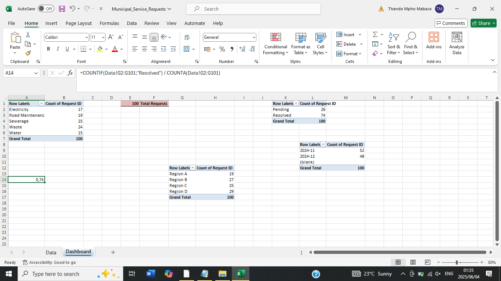

# Municipal Services Dashboard (Excel)

This project showcases a simplified Excel dashboard designed to track municipal service requests. It uses pivot tables, charts, formulas, and slicers to visualize service type trends, resolution efficiency, and regional activity.

## 📊 Features

- Total Requests, % Resolved, Avg. Resolution Time
- Monthly service request trends
- Requests by Region and Service Type
- Resolved vs. Pending breakdown
- Excel slicers for interactivity

## 📁 Files

- `Municipal_Service_Requests.xlsx` – Main dashboard
- `dashboard-overview.png` – Dashboard screenshot (add this)
- `README.md` – Project documentation

## 📷 Screenshot

## 👤 Author

**Thando Mpho Mabaso**  
[LinkedIn](https://www.linkedin.com/in/thando-mabaso-004180192)
